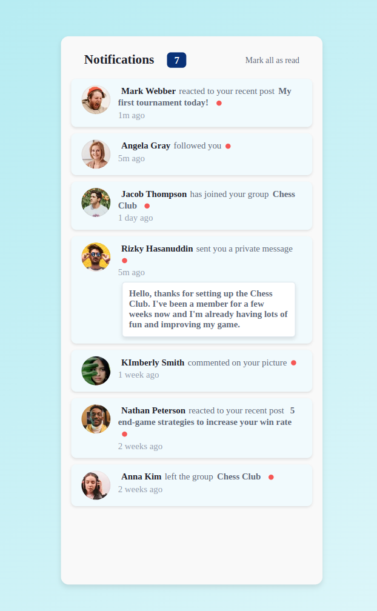

# Notifications Card

### Table of Contents

- [Notifications Card](#notifications-card)
  - [Table of Contents](#table-of-contents)
  - [Introduction](#introduction)
  - [Features](#features)
  - [Installation](#installation)
    - [Tailwind CSS](#tailwind-css)
    - [Styled-components](#styled-components)
  - [JsonData](#jsondata)
  - [useStates](#usestates)

## Introduction

This component can be easily integrated into web applications to keep users informed about recent activities, such as new followers, comments, messages, and more.



## Features

- **Interactive Design**: The Notifications Card features an interactive design that allows users to mark notifications as read with a single click.
- **Dynamic Content**: Notifications are dynamically generated based on user interactions such as reactions, comments, messages, and group activities.
- **Unread Count Indicator**: The card displays the number of unread notifications, providing users with quick visibility into their notification status.
- **Mark All as Read**: Users can easily mark all notifications as read with the click of a button, streamlining the notification management process.

## Installation

To install the Notifications Card component in your React project, follow these steps:

1. Clone the repository to your local machine:
   `git clone <repository-url>`
2. Navigate to the project directory:
   `cd notifications-card`
3. Install the required dependencies using
   `npm install`

Tailwind
https://tailwindcss.com/docs/installation/using-postcss

1. npm install -D tailwindcss postcss autoprefixer
   `npx tailwindcss init`
2. Add the Tailwind directives to your CSS

`@tailwind base;
@tailwind components;
@tailwind utilities;`

Styled-components
https://styled-components.com/docs/basics#installation

# Styled-components

`npm install styled-components`

## JsonData

Notification data for demonstration purposes within the Notifications Card component. Each item in the array represents a notification with various properties such as id, author, reaction, link, time, and hasBeenRead.

## useStates

````jsx
export default function NotificationsCard() {
  const [notifications, setNotifications] = useState(usersData);

  function handleIsRead(coment) {
    notifications[notifications.indexOf(coment)].hasBeenRead = true;
    setNotifications([...notifications]);
  }

  function handleAllRead() {
    setNotifications([
      ...notifications.map((user) => ({ ...user, hasBeenRead: true })),
    ]);
  }
  ...
}```
````
